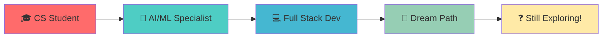

<div align="center">
  
# 👋 Hey there, I'm Jovin Gigu K!
### 🚀 CS & AI/ML Student | Code Enthusiast | Gaming Aficionado


</div>

---

## 🎯 About Me

```python
class Jovin:
    def __init__(self):
        self.name = "Jovin Gigu K"
        self.role = "CS & AI/ML Student"
        self.location = "🌍 Somewhere awesome"
        self.languages = ["Python", "Java", "C", "JavaScript", "SQL"]
        self.interests = ["AI/ML", "Gaming", "Full Stack Development"]
        self.current_focus = "Still figuring out my dream path 🎯"
        self.fun_fact = "I code and game simultaneously! 🎮💻"
    
    def say_hi(self):
        print("Thanks for dropping by! Let's build something amazing together! 🚀")

me = Jovin()
me.say_hi()
```

---

## 🛠️ Tech Arsenal

<div align="center">

### 💻 Languages & Frameworks


### 🗄️ Databases & Tools


### 🤖 AI/ML Focus


</div>

---

## 📊 GitHub Analytics

<div align="center">
  
  
</div>

<div align="center">
  
</div>

---

## 🎮 When I'm Not Coding...

<div align="center">

```ascii
    🎮 GAMING MODE ACTIVATED 🎮
    ┌─────────────────────────┐
    │  ▓▓▓▓▓▓▓▓▓▓▓▓▓▓▓▓▓▓▓  │
    │  ▓ LEVEL: MULTITASKER ▓  │
    │  ▓ SKILL: CODE & GAME ▓  │
    │  ▓ STATUS: LEGENDARY  ▓  │
    │  ▓▓▓▓▓▓▓▓▓▓▓▓▓▓▓▓▓▓▓  │
    └─────────────────────────┘
```

**Fun Fact:** I've mastered the art of debugging code while clutching in competitive games! 🏆

</div>

---

## 🌟 Current Journey

<div align="center">



</div>

> *"Still figuring out my dream path, but every line of code gets me closer!"* 💫

---

## 🌐 Let's Connect!

<div align="center">

[](https://jgk2k4.wordpress.com/)
[](https://github.com/jgk)
[](#)

### 💬 Let's build something amazing together!

</div>

---

<div align="center">

### 🎯 "Code is like humor. When you have to explain it, it's bad." - Cory House


**⭐ If you like what you see, don't forget to star some repos! ⭐**

</div>

---

<div align="center">
  
</div>
