<div align="center">
  
# 👋 Hey there, I'm Jovin Gigu K!
### 🚀 CS & AI/ML Student | Code Enthusiast | Gaming Aficionado


</div>

---

## 🎯 About Me

```python
class Jovin:
    def __init__(self):
        self.name = "Jovin Gigu K"
        self.role = "CS & AI/ML Student"
        self.location = "🌍 Somewhere awesome"
        self.languages = ["Python", "Java", "C", "JavaScript", "SQL"]
        self.interests = ["AI/ML", "Gaming", "Full Stack Development"]
        self.current_focus = "Still figuring out my dream path 🎯"
        self.fun_fact = "I code and game simultaneously! 🎮💻"
    
    def say_hi(self):
        print("Thanks for dropping by! Let's build something amazing together! 🚀")

me = Jovin()
me.say_hi()
```

---

## 🛠️ Tech Arsenal

<div align="center">

### 💻 Languages & Frameworks


### 🗄️ Databases & Tools


### 🤖 AI/ML Focus


</div>

---

## 📊 GitHub Analytics

<div align="center">
  
  
</div>

<div align="center">
  
</div>

---

## 🎮 When I'm Not Coding...

         🎮 GAMER DASHBOARD — ONLINE
        
     ╔════════════════════════════════════════╗
     ║ ▸ MAIN LOADOUT                         ║
     ║     ┗ Valorant                         ║
     ║     ┗ Minecraft (pvp + parkour = chaos)║
     ║                                        ║
     ║ ▸ RECENT QUESTS                        ║
     ║     ┗ It Takes Two (co-op      )       ║
     ║     ┗ Ori and the Will of the Wisps    ║
     ║                                        ║
     ║ ▸ PLAYSTYLE                            ║
     ║     ┗ FPS with aim + chill vibes       ║
     ║     ┗ Down for story-based adventures  ║
     ║                                        ║
     ║ ▸ ALT MODE                             ║
     ║     ┗ Full-stack coding sessions       ║
     ║     ┗ Coffee + keyboard = comfort      ║
     ╚════════════════════════════════════════╝

**Fun Fact:** I've mastered the art of debugging code while clutching in competitive games! 🏆

</div>

---

## 🌟 Current Journey

```mermaid
graph LR
    A[🎓 CS Student] --> B[🤖 AI/ML Specialist]
    B --> C[💻 Full Stack Dev]
    C --> D[🚀 Dream Path]
    D --> E[❓ Still Exploring!]
    
    style A fill:#ff6b6b
    style B fill:#4ecdc4
    style C fill:#45b7d1
    style D fill:#96ceb4
    style E fill:#ffeaa7
    classDef blackFont fill-opacity:1,color:black;
    class A,B,C,D,E blackFont
```

<div align="center">



</div>

> *"Still figuring out my dream path, but every line of code gets me closer!"* 💫

---

## 🌐 Let's Connect!

<div align="center">

### 🌐 Connect With Me

[](https://jgk2k4.wordpress.com/)
[](https://github.com/jgk)
[](#)

---

### 💬 Let’s build something **amazing** together!

</div>


---

<div align="center">

### 🎯 "Code is like humor. When you have to explain it, it's bad." - Cory House


**⭐ If you like what you see, don't forget to star some repos! ⭐**

</div>

---

<div align="center">
  
</div>
